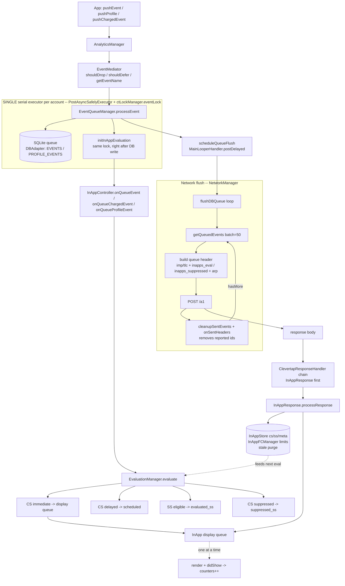
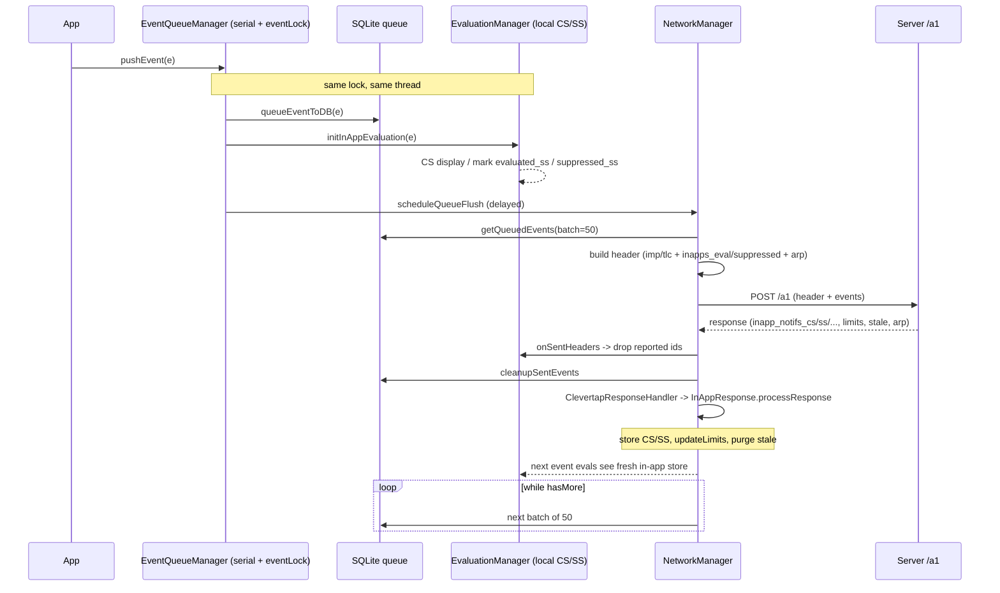
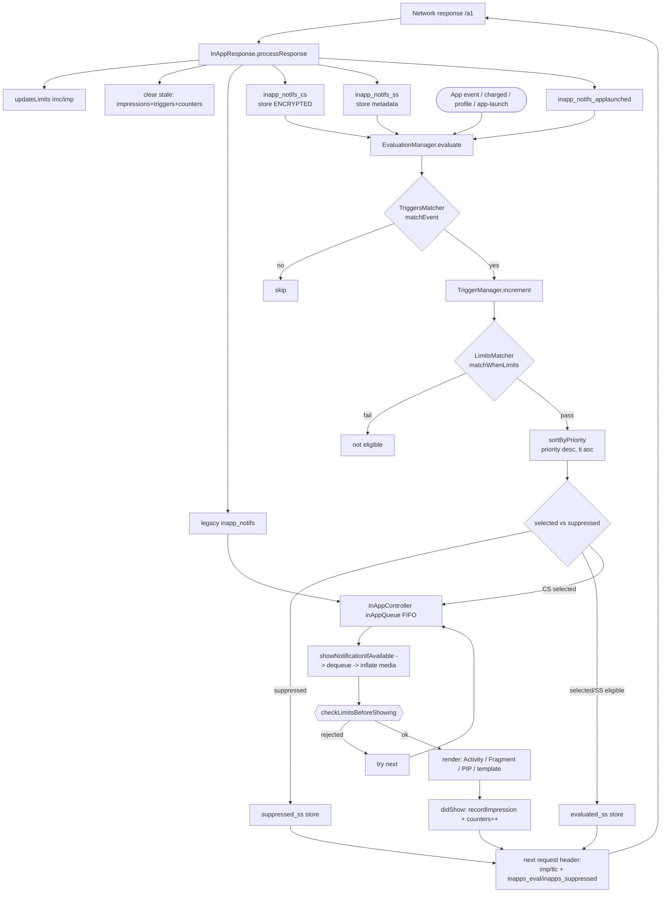
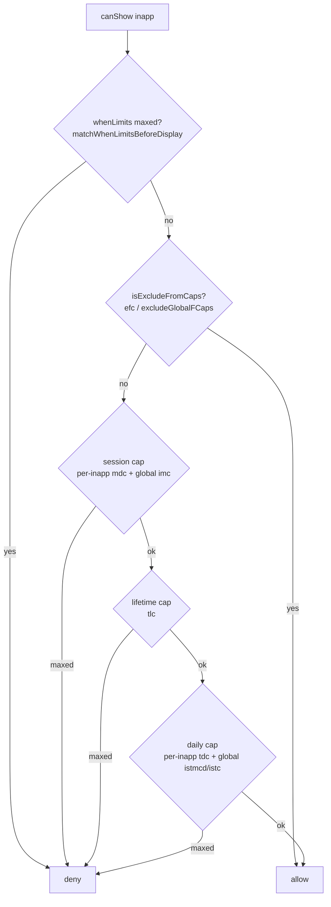
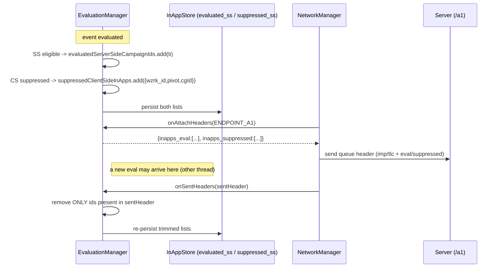
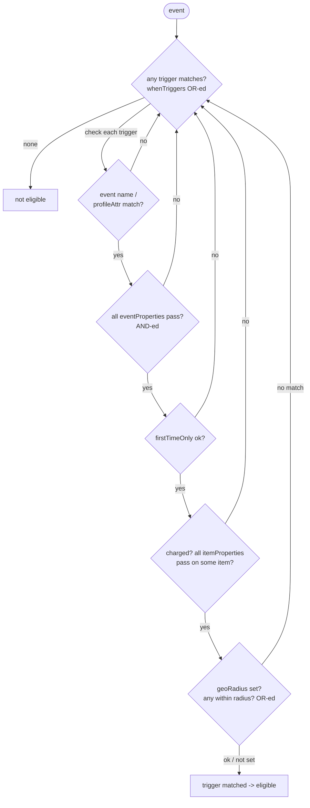

# In-App Notifications: Frequency Caps, Staleness/Meta, and Serving/Rendering

This document explains how the CleverTap Android SDK (`clevertap-core`) handles in-app
notifications end-to-end: the three in-app "families" (client-side, server-side, legacy),
how frequency caps are evaluated, how staleness and request/response meta-headers work,
and how in-apps are served to the SDK and rendered.

All paths are relative to
`clevertap-core/src/main/java/com/clevertap/android/sdk/`.
Line numbers are accurate as of this writing (branch `develop`) and may drift; treat them
as anchors, not guarantees.

---

## 0. Architecture at a glance: event stream ⇄ network ⇄ in-apps

Before the in-app specifics, here's how the whole thing fits together. In-apps are not a
standalone subsystem — they are **driven by the SDK's event pipeline**. Every event the app raises
does two things on the *same* background thread: it gets persisted to the outbound queue **and** it
is run through local in-app evaluation. The server's reply (carrying new in-apps, limits, stale ids)
comes back on that same flush and updates the stores the next evaluation reads.

### 0.1 The block diagram



### 0.2 The request/response round-trip



### 0.3 The "single queue" — what is actually serialized

There are **two distinct one-at-a-time chokepoints**; both are deliberate.

1. **The per-account serial executor (the event pipeline queue).** All event work runs on one
   background thread per account: `CTExecutorFactory.executors(config)` is keyed by `accountId`, and
   `PostAsyncSafelyExecutor` wraps a `newSingleThreadExecutor()`. On top of that, the hot path
   `EventQueueManager.processEvent` runs inside `synchronized(ctLockManager.eventLock)` and, in that
   one critical section, first `queueEventToDB(...)` (272) **then** `initInAppEvaluation(...)` (274).
   Consequence: **DB persistence and in-app evaluation for a given event are atomic and ordered** —
   evaluation always sees the event already committed, and no two events interleave. The network
   flush (`flushDBQueue`) runs on this same executor, so queueing, evaluation, and flushing never race.
   Nuance: this ordering is per task on the executor; it does **not** mean nothing runs during a flush's
   network round-trip. `onAttachHeaders` builds the header and `onSentHeaders` runs after the response,
   and a *separate* event task can be evaluated in between — which is exactly why the eval-header
   lifecycle (§3.2) removes only the ids that were actually sent rather than clearing the whole list.

2. **The in-app display queue (one in-app on screen at a time).** Selected in-apps go through a
   single FIFO (`StoreRegistryInAppQueue`, persisted), and `currentlyDisplayingInApp` +
   `pendingNotifications` guarantee exactly one is rendered at a time; the next is pulled only after
   `inAppNotificationDidDismiss` (see §4.3).

### 0.4 Updates and checks along the path

| Stage | Update / check | Where |
|---|---|---|
| Ingest | drop opted-out/muted, defer pre-launch events | `EventMediator.shouldDropEvent` / `shouldDeferProcessingEvent` |
| Persist | write event to `EVENTS`/`PROFILE_EVENTS` (encrypted `DATA`) | `EventQueueManager.processEvent` → `DBAdapter` |
| Evaluate | trigger match → limit check → priority sort → select/suppress | `EvaluationManager.evaluate` (§4.1, §4.2, §2.2) |
| Header out | attach `imp`/`tlc` counts + `inapps_eval`/`inapps_suppressed` (only `/a1`) | `QueueHeaderBuilder`, `EvaluationManager.onAttachHeaders` (§3.2) |
| Send | batch of 50, loop `while hasMore`; handshake forced after `responseFailureCount > 5`; cadence from `getDelayFrequency()` | `NetworkManager.flushDBQueue` / `sendQueue` |
| After send | remove **exactly** the reported ids; delete sent rows from DB | `onSentHeaders`, `cleanupSentEvents` |
| Response | decorator chain, InApp first: `updateLimits`, stale purge, store CS/SS, route families | `ClevertapResponseHandler` → `InAppResponse.processResponse` (§3.3) |
| Display | TTL + activity/foreground/suspend checks, then the two cap engines | `InAppController` (§4.3), `InAppFCManager.canShow` (§2) |

Key files for this section: `AnalyticsManager.java`, `events/EventMediator.java`,
`events/EventQueueManager.kt`, `task/CTExecutorFactory.kt` / `CTExecutors.java` /
`PostAsyncSafelyExecutor.java`, `db/DBAdapter.kt`, `network/NetworkManager.kt`,
`response/ClevertapResponseHandler.kt`, `CleverTapFactory.kt` (response-chain wiring).

---

## 1. The three in-app families

CleverTap has evolved through three delivery models. All three can arrive in the same
network response and coexist.

| Family | Response key | Where decided | Content in response? | Cap engine |
|---|---|---|---|---|
| **Legacy** | `inapp_notifs` (+ `inapp_notifs_meta` for in-action) | Server picks, SDK just displays | Yes (full content) | `InAppFCManager` global + per-in-app counts only |
| **Server-Side (SS)** | `inapp_notifs_ss` (metadata) / `inapp_notifs_applaunched` | Server sends *candidates*; SDK evaluates triggers + limits locally | Metadata only for `_ss`; full content for app-launched | `EvaluationManager` + `LimitsMatcher` (triggers/whenLimits) **and** `InAppFCManager` at display time |
| **Client-Side (CS)** | `inapp_notifs_cs` | Fully evaluated on device against local events | Yes (full content, stored encrypted) | Same as SS: `EvaluationManager` + `LimitsMatcher` **and** `InAppFCManager` |

Constant definitions (`Constants.java`):
```
INAPP_JSON_RESPONSE_KEY           = "inapp_notifs"                 // 85  legacy content
INAPP_NOTIFS_META_KEY             = "inapp_notifs_meta"            // 86  legacy in-action meta
INAPP_NOTIFS_STALE_KEY            = "inapp_stale"                  // 88  stale IDs
INAPP_NOTIFS_APP_LAUNCHED_KEY     = "inapp_notifs_applaunched"     // 89  SS app-launch content
INAPP_NOTIFS_APP_LAUNCHED_META_KEY= "inapp_notifs_applaunched_meta"// 90  SS app-launch in-action meta
INAPP_NOTIFS_KEY_CS               = "inapp_notifs_cs"             // 92  client-side
INAPP_NOTIFS_KEY_SS               = "inapp_notifs_ss"             // 93  server-side metadata
```

The delivery mode (CS vs SS) is switched by the server and persisted; when the mode flips,
`InAppStore` purges the opposite family's cache (see §4).

---

## 1.5 Flow diagrams (at a glance)

> These Mermaid diagrams render on GitHub. They are the "map"; the sections below are the "terrain".

**End-to-end lifecycle** — response in, events drive evaluation, display gate, results reported back:



**The two cap engines** (both must pass at display time — `InAppFCManager.canShow`):



---

## 2. Frequency capping

There are two cap engines that both must pass before an in-app is shown:

1. **Global + per-in-app counters** — `InAppFCManager` (applies to *all* families).
2. **whenLimits / occurrence limits** — `LimitsMatcher` (only CS/SS carry these).

### 2.1 `InAppFCManager` — the counter-based gate

File: `InAppFCManager.java`. The single entry point is `canShow(...)` (lines 72-107),
called from `InAppController.checkLimitsBeforeShowing()` right before display.

```java
public boolean canShow(CTInAppNotification inapp,
        Function2<JSONObject, String, Boolean> hasInAppFrequencyLimitsMaxedOut) {
    final String id = getInAppID(inapp);
    if (id == null) return true;

    // (a) Re-check whenLimits (LimitsMatcher) in case the msg was queued multiple times
    if (hasInAppFrequencyLimitsMaxedOut.invoke(inapp.getJsonDescription(), id)) return false;

    // (b) Campaign explicitly exempt from all caps?
    if (inapp.isExcludeFromCaps()) return true;

    // (c) Three counter checks — all must be under cap
    if (!hasSessionCapacityMaxedOut(inapp)
            && !hasLifetimeCapacityMaxedOut(inapp)
            && !hasDailyCapacityMaxedOut(inapp)) return true;

    return false;
}
```

**Session cap** (`hasSessionCapacityMaxedOut`, lines 325-349):
- Per-in-app: `impressionManager.perSession(id) >= maxPerSession` (in-memory session count).
  `maxPerSession` = campaign's `mdc` (`INAPP_MAX_DISPLAY_COUNT`) if `>= 0`, else `1000`.
- Global: `impressionManager.perSessionTotal() >= imc` (global per-session limit, **read-default 1**
  if never pushed by the server).

**Lifetime cap** (`hasLifetimeCapacityMaxedOut`, lines 303-323):
- `totalLifetimeCount` (`tlc` on the campaign) `== -1` means uncapped.
- Otherwise `counts[1] >= totalLifetimeCount` where `counts[1]` is the persisted lifetime count.

**Daily cap** (`hasDailyCapacityMaxedOut`, lines 271-300):
- Global first: `shownTodayCount (istc_inapp) >= maxPerDayCount (istmcd_inapp)` (**read-default 1**).
- Then per-in-app: `totalDailyCount` (`tdc`) `== -1` = uncapped; else `counts[0] >= totalDailyCount`.

Note the two different "defaults": when the server pushes global limits they arrive as `imc`/`imp`
in the response and default to **10** (`InAppResponseAdapter`, §2.5); the **1** above is the fallback
`getIntFromPrefs` uses only if `updateLimits` has never run for this account/device.

**Exclude-from-caps**: `CTInAppNotification.isExcludeFromCaps` is set from either
`efc == 1` (`KEY_EFC`) or `excludeGlobalFCaps == 1` (`KEY_EXCLUDE_GLOBAL_CAPS`)
(`CTInAppNotification.kt` ~387-388). When true, `canShow` returns `true` after the
whenLimits check — i.e. it bypasses the session/lifetime/daily *counter* caps but **not**
the `LimitsMatcher` whenLimits.

**Recording an impression** (`didShow`, lines 116-134): on an IO task it calls
`impressionManager.recordImpression(id)`, `incrementInAppCountsInPersistentStore(id)`
(bumps both today and lifetime), and increments the global `istc_inapp` shown-today counter.

**Global limits** are pushed by the server and stored via `updateLimits(context, perDay,
perSession)` (lines 196-202) → writes `istmcd_inapp` (per-day) and `imc` (per-session), both
namespaced `:deviceId:accountId`. `InAppResponse.processResponse` reads them from the response
via `InAppResponseAdapter`: per-session key **`imc`** (`INAPP_MAX_PER_SESSION_KEY`), per-day key
**`imp`** (`INAPP_MAX_PER_DAY_KEY`), each defaulting to **10** if absent.
(The old doc claim of `inApp_notifs_per_day`/`inApp_notifs_per_session` was wrong.)

**Daily reset**: `init()` compares today's date against the stored `ict_date`; on a new day
it resets each in-app's today-count to `0` (keeping the lifetime part) and clears the global
shown-today counter (`istc_inapp`).

### 2.2 `LimitsMatcher` — whenLimits / occurrence limits (CS + SS only)

Files: `inapp/evaluation/LimitsMatcher.kt`, `LimitAdapter.kt`, `ImpressionManager.kt`,
`TriggerManager.kt`.

`matchWhenLimits(whenLimits, campaignId)` returns true only if **every** limit passes.
`whenLimits` is the union of the campaign's frequency limits and occurrence limits.
Per-limit logic (`matchLimit`, lines 40-69):

```
Session   -> impressionManager.perSession(id)        < limit
Seconds   -> impressionManager.perSecond(id, freq)   < limit
Minutes   -> impressionManager.perMinute(id, freq)   < limit
Hours     -> impressionManager.perHour(id, freq)     < limit
Days      -> impressionManager.perDay(id, freq)      < limit
Weeks     -> impressionManager.perWeek(id, freq)     < limit
Ever      -> impressionManager.getImpressions(id).size < limit
OnEvery   -> triggerCount % limit == 0      // show every Nth trigger
OnExactly -> triggerCount == limit          // show only on the Nth trigger
```

`LimitType` values (`LimitAdapter.kt`): `ever, session, seconds, minutes, hours, days,
weeks, onEvery, onExactly`.

- **Impressions** (time-windowed counts) are backed by `ImpressionManager`, which holds
  an in-memory per-session map plus persistent timestamps in `ImpressionStore`
  (`__impressions_<campaignId>` → comma-separated unix seconds). Time-window queries use
  binary search over the timestamp list.
- **Trigger counts** for `onEvery`/`onExactly` are backed by `TriggerManager`
  (`__triggers_<campaignId>` → int). `EvaluationManager.evaluate()` increments the trigger
  count *when the trigger matches*, before checking limits.

### 2.3 Where each family's caps get evaluated — summary

- **Legacy**: only `InAppFCManager.canShow` (no whenLimits). The `hasInAppFrequencyLimitsMaxedOut`
  lambda evaluates to "not maxed" because there are no whenLimits.
- **SS / CS**: evaluated **twice** — once in `EvaluationManager.evaluate()` (trigger match →
  increment trigger count → `matchWhenLimits`) to build the eligible set, and again at display
  time inside `canShow` via `matchWhenLimitsBeforeDisplay` (the "without Nth triggers" re-check,
  guarding against a campaign being queued multiple times before it actually renders).

### 2.4 Where cap state is persisted — the SharedPreferences files

All persistence goes through `StorageHelper.getPreferences(context, namespace)`, which opens a
SharedPreferences file named `WizRocket` (base) or `WizRocket_<namespace>`
(`StorageHelper.kt` 10-17). "Modern" stores build the namespace via
`StoreProvider.constructStorePreferenceName(type, deviceId, accountId)`
(`StoreProvider.kt` ~144). So each concrete file is tied to a **device + account** (multi-user /
multi-account isolation), and the file is chosen by the *store type*.

| What | Prefs file (Android `xml` name) | Keys | Value format | Written by |
|---|---|---|---|---|
| **Per-in-app counters** (today + lifetime) | `WizRocket_counts_per_inapp:<deviceId>:<accountId>` | `<inAppId>` | `"<today>,<lifetime>"` (CSV of two ints) | `InAppFCManager.incrementInAppCountsInPersistentStore` (350-362) |
| **Impression timestamps** (whenLimits time windows) | **same file** `WizRocket_counts_per_inapp:<deviceId>:<accountId>` | `__impressions_<campaignId>` | comma-joined unix-**seconds** | `ImpressionStore.write` (`ImpressionStore.kt` 38-63) |
| **Trigger counts** (onEvery / onExactly) | `WizRocket_triggers_per_inapp:<deviceId>:<accountId>` | `__triggers_<campaignId>` | single int | `TriggerManager.increment` (`TriggerManager.kt` 42-46) |
| **Global FC counters + limits** | base `WizRocket` | `istc_inapp:<deviceId>:<accountId>` (shown-today), `istmcd_inapp:<…>` (max/day), `imc:<…>` (max/session), `ict_date:<…>` (reset date, `ddMMyyyy`) | ints / date string | `InAppFCManager.updateLimits` / `didShow` / `init` |
| **CS/SS in-app payloads & meta** | `WizRocket_inApp:<deviceId>:<accountId>` | `inapp_notifs_cs`, `inapp_notifs_ss`, `inaction_inapp_notifs_ss`, `delayed_inapp_notifs_cs`, `inApp` (SS display queue), `evaluated_ss`, `suppressed_ss` | JSON arrays (CS keys **encrypted**) | `InAppStore.kt` |
| **Legacy SS in-apps** | base `WizRocket` | `inApp:<accountId>` | encrypted JSON array | `LegacyInAppStore.kt` |

Key points and gotchas:

- **Impressions live in the *same* `counts_per_inapp` file as the today/lifetime counters** — they
  are just distinguished by the `__impressions_` key prefix. `STORE_TYPE_IMPRESSION` maps to the
  `KEY_COUNTS_PER_INAPP` namespace (`StoreProvider.kt`), so the two share one xml file.
- **Two different "impression" notions**: `ImpressionManager` keeps an *in-memory* per-session map
  (`perSession`, `perSessionTotal`, cleared on session end) **and** delegates durable timestamps to
  `ImpressionStore`. `recordImpression(id)` writes both. Session counts never hit disk; time-window
  limits (`perSecond/Minute/Hour/Day/Week`, `ever`) read the persisted timestamp list and binary-search
  the window.
- **Which store each cap engine reads**: `InAppFCManager` (session/daily/lifetime counter caps) reads
  the CSV counters + global counters; `LimitsMatcher` (whenLimits) reads `ImpressionStore` timestamps +
  `TriggerManager` counts. The two engines do **not** share counters — a campaign can pass one and fail
  the other.
- **Stale purge touches all three cap stores** (§3.1): `ImpressionStore.clear(id)` +
  `TriggerManager.removeTriggers(id)` (CS/SS state) and `InAppFCManager.processResponse` removes the
  `<inAppId>` key from `counts_per_inapp` (legacy counters).
- **Key migration**: `InAppFCManager` has migrated the counts key across three shapes —
  `counts_per_inapp` (v1) → `…:<deviceId>` (v2) → `…:<deviceId>:<accountId>` (v3, current); old files
  are read once and purged.

### 2.5 Global limits and delivery duration on the wire

`InAppResponseAdapter.kt` (~184-190) reads the response-level knobs that feed the caps and routing:

```
imc  (INAPP_MAX_PER_SESSION_KEY)  -> inAppsPerSession   default 10  -> InAppFCManager.updateLimits
imp  (INAPP_MAX_PER_DAY_KEY)      -> inAppsPerDay        default 10  -> InAppFCManager.updateLimits
inapp_delivery_mode              -> inAppMode           ""/CS/SS/NO_MODE (InAppStore.setMode)
inapp_stale                      -> staleInApps         JSON array of ids (§3.1)
```

Every family is also **partitioned by duration** before routing, via `InAppDurationPartitioner`:

- `delayAfterTrigger` (`InAppDelayConstants`, 1–1200 s, default 0) splits a family into **immediate**
  vs **delayed** in-apps.
- `inactionDuration` (`InAppInActionConstants`, 1–1200 s, default 0) marks **in-action** in-apps
  (fetched/shown only if the user takes no action within the window).

That is why each response key produces a `DurationPartitionedInApps.*` object (immediate / delayed /
inAction / unknown) rather than a flat list — see the routing table in §3.3.

---

## 3. Staleness, meta, and request/response headers

### 3.1 Stale in-apps

The server tells the SDK which campaigns are dead via `inapp_stale` (a JSON array of IDs).
Two independent cleanups run:

- `InAppResponse.clearStaleInAppCache(...)` (~220-228): for each stale ID,
  `impressionStore.clear(id)` and `triggerManager.removeTriggers(id)` — wipes impression
  timestamps and trigger counters (the CS/SS cap state).
- `InAppFCManager.processResponse(...)` (167-194): removes the stale ID's entry from the
  `counts_per_inapp` store — wipes the legacy today/lifetime counters.

The campaign identity used throughout is `ti` (`INAPP_ID_IN_PAYLOAD`), read into
`CTInAppNotification.id`.

### 3.2 Request headers — what the SDK tells the server

The queue/event request header is assembled in `network/QueueHeaderBuilder.kt`
(`buildHeader`, 29-61). Two header pieces matter for in-apps:

**In-app frequency counts** (`addInAppFC`, 188-194):
```kotlin
header.put("imp", it.shownTodayCount)         // global count shown today
header.put("tlc", it.getInAppsCount(context)) // [[targetId, todayCount, lifetimeCount], ...]
```
`getInAppsCount` (140-165) serializes the entire `counts_per_inapp` store as the `tlc`
array so the server knows per-campaign today/lifetime counts. (Note: the literal header
keys are `"imp"` and `"tlc"`; the similarly named `Constants` `imc`/`imp` are the *local*
storage keys for global session/day limits.)

**Evaluated / suppressed meta — the "evals" the SDK reports back.**
`EvaluationManager` implements `NetworkHeadersListener` and contributes two arrays to the queue
header. This is how local evaluation results get back to the server without a separate call.

*What the two arrays are*
- `inapps_eval` (`INAPP_SS_EVAL_META`) — **server-side** campaign `ti`s that the SDK locally
  evaluated as eligible. The server uses this to attribute the impression (it "renders" nothing on
  device for pure SS, so the eval is the signal that the campaign fired). A flat JSON array of longs.
- `inapps_suppressed` (`INAPP_SUPPRESSED_META`) — **client-side** campaigns that qualified but were
  suppressed by a rule (the `isSuppressed` flag). Each entry is an object so the server can still
  count/attribute the suppressed occurrence:
  ```
  { "wzrk_id": "<ti>_<yyyyMMdd>", "wzrk_pivot": "<pivot|wzrk_default>", "wzrk_cgId": <int> }
  ```
  (`suppress()`, EvaluationManager.kt ~540-552; `generateWzrkId` = `ti + "_" + yyyyMMdd`.)

*How each array is populated*
- `inapps_eval`: `evaluateServerSide()` (256) reads SS metadata, runs `evaluate()` per event, and
  `trackAndSaveEvaluatedCampaignIds()` appends each eligible `ti` to the in-memory
  `evaluatedServerSideCampaignIds` **and persists it** to `InAppStore` (`evaluated_ss`).
- `inapps_suppressed`: during `selectAndProcessEligibleInApps()` (396), any eligible in-app whose
  `shouldSuppress()` is true is added via `suppress()` to `suppressedClientSideInApps` and persisted
  (`suppressed_ss`). Both lists are reloaded on init via `loadSuppressedCSAndEvaluatedSSInAppsIds()`,
  so pending reports survive process death.

*Attach → send → remove lifecycle* (the important part for correctness)
```
NetworkManager.applyQueueHeaderListeners(header, endpointId)
   └─ onAttachHeaders(endpointId)                 // EvaluationManager, 632-654
        if endpointId == ENDPOINT_A1 (the "/a1" REGULAR event queue) AND list non-empty:
            header["inapps_eval"]       = evaluatedServerSideCampaignIds
            header["inapps_suppressed"] = suppressedClientSideInApps
   ... request is sent ...
NetworkManager.notifyHeaderListeners(sentBody, endpointId)   // only after send
   └─ onSentHeaders(allHeaders, endpointId)       // 664-672
        removeSentEvaluatedServerSideCampaignIds(allHeaders)  // removes EXACTLY the ti's in the sent header
        removeSentSuppressedClientSideInApps(allHeaders)      // removes entries whose id appears in the sent header
        → re-persists the trimmed lists
```
Why remove-exactly-what-was-sent instead of clearing the whole list: an evaluation can happen on
another thread **between** attach and the actual send. Clearing blindly would drop that new eval; so
`onSentHeaders` only removes the ids that were actually serialized into the sent header
(`removeSent…` iterates the *sent* header's array, not the current in-memory list).

*Endpoint gating*: both arrays are attached **only** for `ENDPOINT_A1` — the regular `/a1` event
queue (`EndpointId.fromEventGroup(REGULAR)`). Push-impression (`-spiky`), `/hello`, and
`/defineVars` requests never carry them.

**ARP** (`arp`) is also attached to the header and updated from the `arp` response key
(`ARPResponse` → `arpRepo.handleARPUpdate`).

*Eval-header lifecycle diagram:*



### 3.3 Response processing entry point and family routing

`response/InAppResponse.java` `processResponse()` (68-218) drives everything. Order of operations:

1. Early-out if analytics-only / empty response / uninitialized stores.
2. `updateLimits(perDay, perSession)` + `InAppFCManager.processResponse` (legacy stale purge).
3. If `inapp_stale` present → `clearStaleInAppCache` (impression + trigger purge).
4. If `inapp_delivery_mode` present → `inAppStore.setMode(mode)` (may drop the opposite cache, §3.4).
5. Route **six** families, each already split by duration (§2.5):

| Response key | Content? | Immediate | Delayed | In-action | Terminal handler |
|---|---|---|---|---|---|
| `inapp_notifs` (legacy) | full | `displayInApp` → `InAppController.addInAppNotificationsToQueue` | `scheduleDelayedLegacyInApps` | — | queue / delay timer |
| `inapp_notifs_meta` (legacy in-action) | meta | — | — | `scheduleInActionInApps` | in-action timer → fetch |
| `inapp_notifs_applaunched` (SS app-launch) | full | `onAppLaunchServerSideInAppsResponse` | delayed app-launch variant | — | `EvaluationManager.evaluateOnAppLaunchedServerSide` |
| `inapp_notifs_applaunched_meta` (SS app-launch in-action) | meta | — | — | `onAppLaunchServerSideInactionInAppsResponse` | evaluate → in-action timer |
| `inapp_notifs_cs` (client-side) | full (**encrypted**) | `InAppStore.storeClientSideInApps` | `storeClientSideDelayedInApps` | — | stored; evaluated on client events |
| `inapp_notifs_ss` (server-side meta) | meta | `storeServerSideInAppsMetaData` (unknown-duration) | — | `storeServerSideInActionMetaData` | stored; evaluated + reported via header |

6. Asset preloading: `res.getPreloadAssetsMeta()` → `FileResourcesRepo.preloadFilesAndCache`; on a
   full response, `cleanupStaleFiles` prunes assets no longer referenced.

**Legacy vs CS/SS** is decided purely by *which key* carries the in-app: legacy keys are shown/queued
directly with content; CS is stored-with-content and evaluated locally on events; SS is stored as
metadata and only materializes content after local evaluation reports eligibility to the server (or,
for app-launch SS, is evaluated immediately on the app-launch event).

`clearStaleInAppCache` (220-227): for each id in `inapp_stale`, `impressionStore.clear(id)` and
`triggerManager.removeTriggers(id)`.

### 3.4 Storage and TTL

`inapp/store/preference/InAppStore.kt` keys:
```
inapp_notifs_cs              CS in-apps (ENCRYPTED via CryptHandler)
inapp_notifs_ss              SS metadata (plaintext)
inaction_inapp_notifs_ss     SS in-action metadata
delayed_inapp_notifs_cs      delayed CS in-apps
PREFS_EVALUATED_INAPP_KEY_SS evaluated SS IDs pending report
PREFS_SUPPRESSED_INAPP_KEY_CS suppressed CS meta pending report
```
Mode change semantics: SS→CS drops all SS caches, CS→SS drops all CS caches, `NO_MODE` drops
everything.

**TTL/expiry**: `CTInAppNotification.timeToLive` comes from `wzrk_ttl` (`WZRK_TIME_TO_LIVE`),
defaulting to `now + 2 days`. At display time `InAppController` drops the in-app if
`now/1000 > timeToLive` ("InApp has elapsed its time to live"). For SS/CS, `EvaluationManager.
updateTTL` can (re)compute `wzrk_ttl = now + wzrk_ttl_offset` when a campaign becomes eligible.

---

## 4. Serving and rendering — how an in-app reaches the screen

### 4.1 Evaluation (CS/SS) on events

`inapp/evaluation/EvaluationManager.kt` hooks (called from `InAppController.onQueue*`):
- `evaluateOnEvent` (raised events), `evaluateOnChargedEvent`, `evaluateOnUserAttributeChange`
- `evaluateOnAppLaunchedClientSide` / `evaluateOnAppLaunchedServerSide`

Core loop `evaluate(event, inappNotifs)` (355-393):
1. `triggersMatcher.matchEvent(getWhenTriggers(inApp), event)` — see §4.2.
2. On match: `triggersManager.increment(campaignId)`.
3. `limitsMatcher.matchWhenLimits(getWhenLimits(inApp), campaignId)` — §2.2.
4. If both pass, add to `eligibleInApps`.

Then `sortByPriority(eligibleInApps)` (522-532): sort by `priority` **descending**
(`INAPP_PRIORITY`, default 1, range 1–100), tie-broken by `ti` **ascending** (earliest wins).
A strategy (immediate vs delayed) selects the winner(s); suppressed ones are recorded to the
CS-suppressed store; TTL may be updated; selected in-apps are handed to the controller queue.

### 4.2 Trigger matching — how in-apps are filtered by events

This is the heart of "which in-apps qualify". Files:
`inapp/evaluation/TriggersMatcher.kt`, `TriggerAdapter.kt`, `TriggerValue.kt`, `EventAdapter.kt`.

**Structure of a trigger** (`TriggerAdapter`): a campaign's `whenTriggers` is a JSON array of
triggers. Each trigger has:
- `eventName` (or `profileAttrName` for user-attribute-change triggers),
- `eventProperties` — a list of `TriggerCondition{propertyName, op, value}` (event property filters),
- `itemProperties` — same shape, applied to line-items of a **Charged** event,
- `geoRadius` — a list of `{lat, lng, radius}`,
- `firstTimeOnly` — boolean.

**Combining logic** (`matchEvent` → `match`, TriggersMatcher.kt 33-76):

```
whenTriggers      : trigger1 OR trigger2 OR …           (any() — TriggersMatcher 41)
within a trigger  : eventName match
                    AND all eventProperties            (matchPropertyConditions, AND — 87-101)
                    AND firstTimeOnly (if set)         (matchFirstTimeOnly, 78-85)
                    AND all itemProperties (if Charged)(matchChargedItemConditions, 103-120)
                    AND any geoRadius (if geoRadiusCount>0)  (matchGeoRadius, OR — 131-151)
charged items     : all conditions AND-ed, but each condition matches if ANY item satisfies it
                    (outer all{}, inner any{})
```



- **Event-name match** (54-57): case/whitespace-insensitive (`Utils.areNamesNormalizedEqual`).
  Matches if the event name matches **or** both sides' `profileAttrName` match (attribute-change path).
- **first-time-only** (78-85): passes only if `localDataStore.isUserEventLogFirstTime(key)` — i.e. the
  event/attribute has been seen exactly once. Key is `profileAttrName ?: eventName`.
- **geo-radius** (`evaluateDistance`, 198-202): Haversine distance ≤ radius; needs a valid
  `event.userLocation`.
- **System / mapped properties** (`EventAdapter` 37-59, `getActualPropertyValue` 121-136): lookups fall
  back from the literal name → normalized name → a mapping table for CT system props
  (`CT App Version`/`ct_app_version` → `CLTAP_APP_VERSION`, latitude/longitude, OS/SDK version, carrier,
  network type, wifi, bluetooth) and for `wzrk_id`/variant/pivot.

**Operators** (`TriggerOperator`, TriggerAdapter.kt 33-56; evaluated in `TriggersMatcher.evaluate`
164-185). If the actual value is **null**, only `NotSet` matches; everything else is false.

| Operator | int | Semantics | Coercion / notes |
|---|---|---|---|
| `Set` | 26 | property exists (non-null) | — |
| `NotSet` | 27 | property absent (null) | the only op that is true on null |
| `Equals` | 1 | actual == expected | list↔list (set equality), scalar-in-list either direction, else numeric-then-string; strings compared trimmed+lowercased |
| `NotEquals` | 15 | `!Equals` | same as Equals |
| `LessThan` | 2 | actual < expected | both coerced to `Double` (numbers or numeric strings); list-expected uses first element |
| `GreaterThan` | 0 | actual > expected | same coercion as LessThan |
| `Between` | 4 | expected[0] ≤ actual ≤ expected[1] | expected must be a ≥2-element list; all coerced to `Double`; inclusive |
| `Contains` | 3 | actual contains expected | string-substring (case-insens.), list-contains-element, list-contains-any-of-list |
| `NotContains` | 28 | `!Contains` | same as Contains |

`TriggerValue` normalizes each value on construction: strings/booleans are stored raw **and** cleaned
(trimmed + lowercased); numbers stay `Number`; lists/`JSONArray` clean their string elements. Numeric
comparisons accept numeric **strings** ("42" behaves like 42).

### 4.3 The display pipeline

`inapp/InAppController.kt`:
- `showNotificationIfAvailable()` → `_showNotificationIfAvailable()` (717-762): checks the
  current activity isn't blacklisted, not `SUSPENDED`, drains `pendingNotifications`, then
  `inAppQueue.dequeue()` (SS queue is FIFO, persisted via `StoreRegistryInAppQueue`).
- `prepareNotificationForDisplay()` → `InAppNotificationInflater.inflate()`: builds the
  `CTInAppNotification` and downloads media / custom-template files off the main thread, then
  fires `notificationReady()`.
- `displayNotification()` → `checkLimitsBeforeShowing()` (932-970): the final cap gate —
  builds the `hasInAppFrequencyLimitsMaxedOut` lambda (`matchWhenLimitsBeforeDisplay`) and
  calls `inAppFCManager.canShow(...)`. Also an optional host-app `beforeShow(kvs)` veto.
- State/robustness checks: discarded → drop; app backgrounded, another in-app showing,
  blacklisted activity, or suspended → park in `pendingNotifications`; TTL expired → drop;
  HTML in-app with no network → skip and try next.
- Dispatch by type: full-screen (Cover/Interstitial/Alert/Half-Interstitial) →
  `InAppNotificationActivity`; Header/Footer banners → `CTInAppBaseFragment`; PIP → `PIPManager`;
  custom-code template → `TemplatesManager.presentTemplate`.

`currentlyDisplayingInApp` + `pendingNotifications` (a synchronized static list) enforce
**one in-app at a time**.

### 4.4 Post-display accounting

- `inAppNotificationDidShow` (493-506): `inAppFCManager.didShow` (records impression + bumps
  counts, §2.1), pushes the "viewed" analytics event, host `onShow` callback.
- `inAppNotificationActionTriggered` (271-353): sets `wzrk_id`/`c2a`, pushes the clicked event
  (unless local in-app), then executes the action (open URL, key-values, etc.).
- `inAppNotificationDidDismiss` (447-491): records dismissal, clears
  `currentlyDisplayingInApp`, and calls `_showNotificationIfAvailable()` to advance the queue.

### 4.5 In-app types and their renderers

`CTInAppType` (`inapp/CTInAppType.kt`) enumerates every layout; `CTInAppNotification.configureWithJson`
picks it from the `type` field (a null `type` or `"html"` takes the legacy path). Dispatch happens in
`InAppController.showInApp` (~1059-1174):

| `CTInAppType` (wire value) | Renderer |
|---|---|
| `CTInAppTypeCover`/`Interstitial`/`HalfInterstitial` (+ their `…HTML` and `…ImageOnly` variants), `CTInAppTypeAlert` | `InAppNotificationActivity` (full-screen) |
| `CTInAppTypeHeaderHTML` / `CTInAppTypeFooterHTML` | `CTInAppHtmlHeader/FooterFragment` if `FragmentActivity`; else, if `fragmentlessInAppBannersEnabled`, a WindowManager overlay (`showHtmlBannerOverlay`) |
| `CTInAppTypeHeader` / `CTInAppTypeFooter` | `CTInAppNativeHeader/FooterFragment` |
| `CTInAppTypePIP` | `PIPManager.show` (floating window) |
| `CTInAppTypeCustomCodeTemplate` (`custom-code`) | `TemplatesManager.presentTemplate` (visual or non-visual) |
| `UNKNOWN` | dropped with an error log |

Type-specific validation in `configureWithJson` (446-476): image-only and PIP types require a media
entry (else `error`), and Cover/HalfInterstitial/Header/Footer strip any video/audio media they can't
render.

---

## 5. End-to-end flow (condensed)

```
Network response
  └─ InAppResponse.processResponse
       ├─ updateLimits (global istmcd_inapp / imc)
       ├─ clearStaleInAppCache + InAppFCManager.processResponse   (inapp_stale)
       ├─ legacy inapp_notifs        → queue / delayed / in-action
       ├─ inapp_notifs_applaunched   → evaluateOnAppLaunchedServerSide
       ├─ inapp_notifs_cs            → InAppStore.storeClientSideInApps (encrypted)
       └─ inapp_notifs_ss            → InAppStore.storeServerSideInAppsMetaData

Event (raised / charged / profile / app-launch)
  └─ EvaluationManager.evaluate
       ├─ TriggersMatcher.matchEvent          (whenTriggers, OR of AND-groups)
       ├─ TriggerManager.increment            (for onEvery/onExactly)
       ├─ LimitsMatcher.matchWhenLimits       (session/time/ever/onEvery/onExactly)
       ├─ sortByPriority  (priority desc, ti asc)
       └─ selected → InAppController queue  (suppressed → suppressed store → header report)

Display
  └─ showNotificationIfAvailable → dequeue → inflate(media) → displayNotification
       └─ checkLimitsBeforeShowing
            ├─ matchWhenLimitsBeforeDisplay      (LimitsMatcher re-check, no Nth trigger)
            └─ InAppFCManager.canShow
                 ├─ excludeFromCaps? → allow
                 ├─ session cap (per-inapp mdc + global imc)
                 ├─ lifetime cap (tlc)
                 └─ daily cap (per-inapp tdc + global istmcd_inapp/istc_inapp)
       └─ render (Activity / Fragment / PIP / custom template)
            └─ didShow → recordImpression + increment counts + istc_inapp++

Next request header
  ├─ imp = shownTodayCount, tlc = [[ti, today, lifetime], ...]   (QueueHeaderBuilder.addInAppFC)
  └─ inapps_eval / inapps_suppressed                              (EvaluationManager.onAttachHeaders)
```

---

## 6. Key file index

| Concern | File |
|---|---|
| Counter caps (global + per-inapp), stale purge, header counts | `InAppFCManager.java` |
| whenLimits / occurrence limits | `inapp/evaluation/LimitsMatcher.kt`, `LimitAdapter.kt` |
| Impression storage (timestamps, time windows) | `inapp/ImpressionManager.kt`, `inapp/store/preference/ImpressionStore.kt` |
| Trigger counts (onEvery/onExactly) | `inapp/TriggerManager.kt` |
| Trigger matching + operators + value coercion | `inapp/evaluation/TriggersMatcher.kt`, `TriggerAdapter.kt`, `TriggerValue.kt`, `EventAdapter.kt` |
| Eligibility, priority sort, suppression, TTL, header meta | `inapp/evaluation/EvaluationManager.kt` |
| Response parsing / routing + duration partition | `response/InAppResponse.java`, `inapp/data/InAppResponseAdapter.kt`, `inapp/data/InAppDurationPartitioner*` |
| CS/SS storage, mode switching, TTL | `inapp/store/preference/InAppStore.kt`, `LegacyInAppStore.kt` |
| Prefs file-name construction (namespaces) | `StorageHelper.kt`, `StoreProvider.kt` |
| Request header assembly (imp/tlc, arp) | `network/QueueHeaderBuilder.kt` |
| Serving queue + render pipeline | `inapp/InAppController.kt`, `inapp/StoreRegistryInAppQueue.kt`, `inapp/InAppNotificationInflater.kt` |
| In-app model / JSON parsing | `inapp/CTInAppNotification.kt` |
| In-app types → renderers | `inapp/CTInAppType.kt` |
| Event pipeline (ingest → serial executor → DB → flush) | `AnalyticsManager.java`, `events/EventMediator.java`, `events/EventQueueManager.kt`, `task/CTExecutorFactory.kt`, `task/PostAsyncSafelyExecutor.java`, `db/DBAdapter.kt` |
| Network flush + response-chain wiring | `network/NetworkManager.kt`, `response/ClevertapResponseHandler.kt`, `CleverTapFactory.kt` |
| Constants (all keys above) | `Constants.java` |
