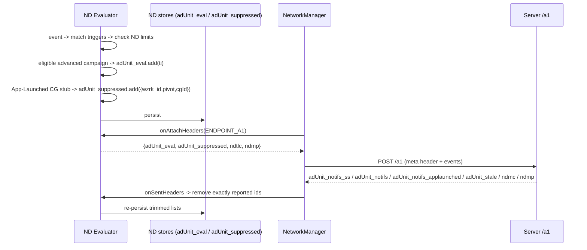
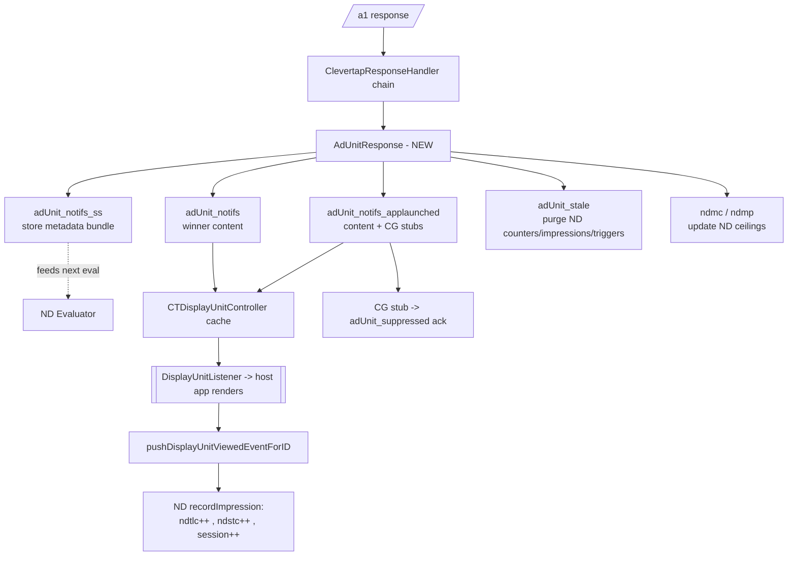
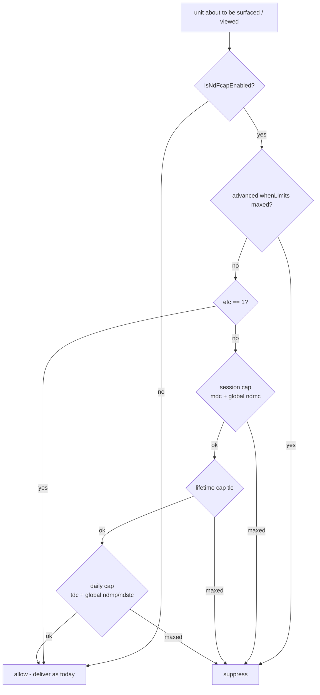

# Native Display Frequency Caps — Android SDK TAN

Android SDK Technical Approach Note for **Native Display (ND) Frequency Caps**
(epic [SDK-6055](https://wizrocket.atlassian.net/browse/SDK-6055), TAN task
[SDK-6056](https://wizrocket.atlassian.net/browse/SDK-6056)).

This document is the SDK-side companion to the cross-team design, written to mirror the structure
of [`InAppFrequencyCapsAndServing.md`](./InAppFrequencyCapsAndServing.md). It will be published to
Confluence (child of the *Native Display Fcaps* landing page) once reviewed.

**Source of truth for the contract/design (read these first):**
- BE + SDK design TAN — *Fcaps in ND campaigns*: https://wizrocket.atlassian.net/wiki/spaces/EN/pages/6985482280
- Wire contract — *FE ↔ BE ↔ SDK Contract*: https://wizrocket.atlassian.net/wiki/spaces/EN/pages/6986170380
- Landing — *Native Display Fcaps*: https://wizrocket.atlassian.net/wiki/spaces/EN/pages/6972964894

Paths are relative to `clevertap-core/src/main/java/com/clevertap/android/sdk/`.

---

## 0. TL;DR (the decisions that shape the SDK work)

- **ND on Android = the Display Units subsystem** (`displayunits/`, response key `adUnit_notifs`).
  Today it is a thin parse-and-cache-and-callback path; **the host app renders the unit**, the SDK
  does not. This is the single biggest structural difference from in-app.
- **ND is SS + Legacy only — there is NO Client-Side (CS) mode, no in-action, no delivery-mode
  switching.** We port the *server-side eval* and *legacy counter* halves of the in-app fcap system,
  not the CS half.
- **Fully separate per-channel state.** ND gets its own counters/impressions/triggers/metadata
  stores. It never shares files or in-memory state with in-app. Wire: `ndtlc` (per-target counts),
  `ndmp` (global daily count/ceiling), `ndmc` (session ceiling) — all separate from `tlc`/`imp`/`imc`.
- **Two fcap models:** *advanced* (frequencyLimits + occurrenceLimits + excludeGlobalFCaps) for
  standalone ND **campaigns**; *legacy* (`efc`/`tlc`/`tdc`/`mdc`) for ND **journey nodes**.
- **The fcap/limit/trigger schema is identical to in-app.** `frequencyLimits`↔`AdvancedLimits.fCaps`,
  `occurrenceLimits`↔`AdvancedLimits.triggers`. This is what makes engine reuse viable.
- **Impression accounting is app-driven for ND** (`pushDisplayUnitViewedEventForID`), whereas in-app
  is SDK-driven (`didShow`). The natural hook for ND `recordImpression` is the viewed-event path.
- **The delivery mechanism (the `DisplayUnitListener` callback) is unchanged** — we keep giving units
  to the client via the callback, but now the SDK **gates which units it hands over based on the
  fcaps**, exactly as in-app gates display. Only *whether/when* the callback fires becomes cap-aware.
- Gated behind LaunchDarkly `rollout-native-display-fcaps` + an SDK-version gate (LC returns V2 vs
  V1). Old SDK ⇒ V1 ⇒ delivery unchanged.

---

## 1. What exists today on Android (baseline)

ND is delivered through **Display Units**, entirely separate from in-app:

| Concern | Where | Notes |
|---|---|---|
| Response key | `Constants.DISPLAY_UNIT_JSON_RESPONSE_KEY = "adUnit_notifs"` | already parsed today |
| Response processor | `response/DisplayUnitResponse.java` → `parseDisplayUnits()` | in the `ClevertapResponseHandler` chain |
| Model | `displayunits/model/CleverTapDisplayUnit.java` (`unitID`, `type` `CTDisplayUnitType`, `bgColor`, content array, custom KV) | not `CTInAppNotification` |
| Cache | `displayunits/CTDisplayUnitController.java` (implements `DisplayUnitCache`) | `updateDisplayUnits` / `getAllDisplayUnits` / `getDisplayUnitForID` / `reset` |
| Delivery to app | `DisplayUnitListener` callback | **host app renders** |
| Viewed event | `AnalyticsManager.pushDisplayUnitViewedEventForID(unitID)` → `NOTIFICATION_VIEWED_EVENT_NAME` | app-driven |
| Clicked event | `pushDisplayUnitClickedEventForID` / `pushDisplayUnitElementClickedEventForID` | app-driven |

**Consequences for fcaps:**
- There is **no SDK render pipeline / display queue** to gate at (contrast in-app §4.3). Enforcement
  and impression recording must attach to *delivery* and to the *viewed event*, not to a render step.
- Today ND fires with only server-side priority-lock + CG suppression; **no per-campaign, per-user, or
  global caps run**. This project introduces them.

---

## 2. What's changing (the layer we add)

We add an ND fcap + SS-eval layer alongside the existing Display Units path:

1. **ND evaluation** on the event stream (mirrors in-app SS): match triggers → count → check limits →
   vote eligible advanced campaigns into `adUnit_eval` (reported in the request meta header).
2. **ND metadata store** for the `adUnit_notifs_ss` bundle (advanced-rule campaigns, rules only).
3. **ND counter/impression/trigger stores** — separate from in-app — powering both the SDK-side caps
   and the request-meta counters (`ndtlc`, `ndmp`).
4. **ND FC gate** (`canShow`-equivalent) applied when a unit would be surfaced, plus a global-daily
   re-check; session cap against `ndmc`.
5. **CG-suppression ack** (`adUnit_suppressed`) for the App-Launched content-in-advance path only.
6. **Dead-target GC** honoring `adUnit_stale`.
7. **Mid-session refresh** trigger `wzrk_fetch t=WZRK_FETCH_ND_META`.

The existing render/callback path (host renders the unit) is **unchanged**; content still arrives in
`adUnit_notifs` (regular / journey winner) and now also `adUnit_notifs_applaunched` (App-Launched).

---

## 3. Wire mapping (in-app → ND)

| Concern | In-app (existing) | ND (new) | Direction |
|---|---|---|---|
| Campaign content | `inapp_notifs` | `adUnit_notifs` | resp |
| App-launch content (+ CG stubs) | `inapp_notifs_applaunched` | `adUnit_notifs_applaunched` | resp |
| SS metadata bundle (rules only) | `inapp_notifs_ss` | `adUnit_notifs_ss` | resp |
| Stale ids (GC) | `inapp_stale` | `adUnit_stale` | resp |
| Session ceiling | `imc` | `ndmc` | resp |
| Daily ceiling | `imp` | `ndmp` | resp (overload) |
| Per-target counts | `tlc` = `[[ti,today,life],…]` | `ndtlc` = `[[ti,today,life],…]` | req |
| Global daily count | `imp` (pre-summed int) | `ndmp` (pre-summed int) | req (overload) |
| Eval vote list | `inapps_eval` | `adUnit_eval` | req |
| CG-suppressed acks | `inapps_suppressed` | `adUnit_suppressed` | req |
| SS meta-fetch trigger | `FETCH_TYPE_IN_APPS = 5` | `WZRK_FETCH_ND_META` (**placeholder 100 — lock with BE**) | req |
| Account defaults (session/day) | `ism`/`imp` = 1/10 | `ndsm`/`ndmp` = **1/10** | account |
| Legacy campaign caps | `efc`/`tlc`/`tdc`/`mdc` | same keys | resp/config |

`ndmp` **directional overload** (identical to in-app `imp`): request-side = the SDK's own daily ND
render count; response-side = the account daily ceiling. Keep the two roles straight in the code.

All ND request-meta fields ride inside the same `type:"meta"` header entry as the in-app fields
(`QueueHeaderBuilder`), e.g.:

```json
{ "type":"meta",
  "tlc":[["55001",3,12]], "imp":5, "inapps_eval":[55001], "inapps_suppressed":[],
  "ndtlc":[["70001",1,4]], "ndmp":2, "adUnit_eval":[70001], "adUnit_suppressed":[] }
```

---

## 4. Storage layout (new ND stores)

Follow the exact in-app pattern (`StoreProvider.constructStorePreferenceName(type, deviceId,
accountId)` → `StorageHelper` file `WizRocket_<namespace>`), with **new namespaces** so ND never
collides with in-app:

| State | Proposed prefs file | Key | Value | Mirror of |
|---|---|---|---|---|
| Per-target counters (today+lifetime) | `WizRocket_nd_counts_per_target:<deviceId>:<accountId>` | `<ti>` | `"today,lifetime"` | `counts_per_inapp` (`InAppFCManager`) |
| Impression timestamps (whenLimits windows) | **same** `nd_counts_per_target:…` file | `__impressions_<ti>` | unix-seconds CSV | `ImpressionStore` |
| Trigger counts (onEvery/onExactly) | `WizRocket_nd_triggers_per_target:<deviceId>:<accountId>` | `__triggers_<ti>` | int | `TriggerManager` |
| Global ND counters + ceilings | base `WizRocket` | `ndstc:<…>` (shown-today), `ndmp:<…>` (day ceiling), `ndmc:<…>` (session ceiling), `nd_ict_date:<…>` | ints / date | `istc_inapp`/`istmcd_inapp`/`imc`/`ict_date` |
| Advanced metadata bundle | `WizRocket_adUnit:<deviceId>:<accountId>` | `adUnit_notifs_ss` | JSON array (plaintext — SS only, no CS encryption) | `inapp_notifs_ss` in `InAppStore` |
| Eval / suppressed pending report | `WizRocket_adUnit:…` | `adUnit_eval`, `adUnit_suppressed` | JSON arrays | `evaluated_ss` / `suppressed_ss` |

Notes:
- **No encrypted CS store** and **no delivery-mode/purge machinery** — ND has no CS mode.
- Impressions share the counters file (via the `__impressions_` prefix) exactly like in-app.
- New `STORE_TYPE_ND_*` constants in `StoreProvider` (mirrors `STORE_TYPE_IMPRESSION`, etc.).
- New constants: `KEY_ND_COUNTS_PER_TARGET`, `KEY_ND_TRIGGERS_PER_TARGET`, `ND_MAX_PER_SESSION`
  (`ndsm`/`ndmc`), `ND_MAX_PER_DAY` (`ndmp`), `ND_COUNTS_SHOWN_TODAY` (`ndstc`), plus the wire keys.

---

## 5. Cap model & SDK enforcement matrix

From the design TAN §7, the SDK's responsibilities (what the SDK must enforce locally):

| Cap | Applies to | SDK enforces? | How on SDK |
|---|---|---|---|
| `isNdFcapEnabled == false` short-circuit | all | yes | skip ND eval entirely → deliver as today |
| `efc == 1` (exclude from caps) | basic campaigns + journeys | yes | short-circuit allow |
| `tlc` once-per-user-for-campaign | basic campaigns + journeys | yes | lifetime counter (`ndtlc[…][2]`) |
| `tdc` once-per-day | basic campaigns + journeys | yes | today counter (`ndtlc[…][1]`) + daily reset |
| `mdc` once-per-session | basic campaigns + journeys | **yes (SDK-only)** | in-memory session count |
| `frequencyLimits` (AND) | advanced campaigns | yes | `LimitsMatcher` over ND ImpressionStore |
| `occurrenceLimits` (onEvery/onExactly) | advanced campaigns | yes | `LimitsMatcher` over ND TriggerManager |
| ND global daily (`ndmp`, def 10) | all ND unless `excludeGlobalFCaps` | yes (canShow re-check) | global `ndstc` vs `ndmp` ceiling |
| ND global session (`ndsm`/`ndmc`, def 1) | all ND | **yes (SDK-only)** | session render count vs `ndmc` |

Precedence (same as in-app): `isNdFcapEnabled==false` overrides all; then `efc==1` short-circuits;
`excludeGlobalFCaps==true` bypasses only the ND global-daily cap.

The elegant simplification: **the SDK does not need to classify campaigns.** Only advanced-rule,
non-journey campaigns ever appear in `adUnit_notifs_ss` (the server's eligibility filter, design §6.7).
So "evaluate everything in the metadata bundle and vote the eligible ones into `adUnit_eval`" is
correct by construction — journeys and simple campaigns never reach the SDK evaluator.

---

## 6. Evaluation & the eval-header flow

### 6.1 Where ND evaluation hooks in
Same event stream as in-app (§0 of the in-app doc): on the per-account serial executor, right after
the event is queued to DB, `initInAppEvaluation` runs. We add an **ND evaluation sibling** invoked in
the same place so ND sees the committed event. It reads the `adUnit_notifs_ss` bundle and, per event:
1. `TriggersMatcher.matchEvent(whenTriggers, event)`  *(see open question Q1)*
2. on match → ND `TriggerManager.increment(ti)`
3. `LimitsMatcher.matchWhenLimits(whenLimits, ti)` over the **ND** impression/trigger stores
4. eligible → add `ti` to `adUnit_eval`

### 6.2 `adUnit_eval` — the vote list
Advanced-rule campaigns the SDK deemed eligible on this event. The server delivers content
(`adUnit_notifs`) only for campaigns present in `adUnit_eval` (design §6.4/§6.9). Simple campaigns and
journey nodes are **not** voted (server evaluates them fully). May contain duplicates → server dedups.

### 6.3 `adUnit_suppressed` — CG acks (App-Launched only)
Server ships CG-suppressed campaigns as **stubs** (`suppressed:true` + `wzrk_cgId`) inline in
`adUnit_notifs_applaunched`. The SDK acks each at its would-have-been-surfaced moment with the bare
shape `{wzrk_id, wzrk_pivot, wzrk_cgId}` (identical to `inapps_suppressed`; reuse
`SuppressionMetaConverter`).
- **Only for the App-Launched content-in-advance path.** On regular events the server decides CG
  itself and needs **no** SDK ack.

### 6.4 Attach → send → remove lifecycle
Reuse the in-app `NetworkHeadersListener` mechanism (attach only for `ENDPOINT_A1` `/a1`):
`onAttachHeaders` adds `adUnit_eval`/`adUnit_suppressed` (+ `ndtlc`/`ndmp` counters via the header
builder); `onSentHeaders` removes **exactly** the ids present in the sent header (so a concurrent ND
eval isn't lost). Persist both lists (`adUnit_eval`/`adUnit_suppressed`) so pending reports survive
process death.



---

## 7. Flows & diagrams

### 7.1 Response routing (new ND keys)



### 7.2 The ND cap gate (mirrors in-app canShow, minus CS)



### 7.3 App-Launched vs regular-event dispatch (server-side, for SDK context)
- **App-Launched:** union of app-launched + no-trigger ND targets, sorted priority DESC then ti ASC.
  Journey wins alone (→ `adUnit_notifs`); otherwise campaign lock-in delivers one-or-more campaigns
  (real + CG stubs) under `adUnit_notifs_applaunched`. **SDK must ack CG stubs** via `adUnit_suppressed`.
- **Regular event:** one target per event (server hard-stops after first delivery). Advanced-rule
  campaigns gated on `adUnit_eval`; journeys + simple bypass. **No SDK CG ack** on this path.

---

## 8. Reuse vs new — component plan

**Reuse / generalize into a channel-agnostic core** (pure logic; parameterize the store + wire keys):
- `inapp/evaluation/TriggersMatcher.kt`, `TriggerAdapter.kt`, `TriggerValue.kt`, `EventAdapter.kt`
- `inapp/evaluation/LimitsMatcher.kt`, `LimitAdapter.kt`, `LimitType`
- The `evaluate()` loop + `sortByPriority` from `EvaluationManager.kt` (extract the channel-specific
  store reads/writes and header lists behind an interface)
- `SuppressionMetaConverter` + the `{wzrk_id,wzrk_pivot,wzrk_cgId}` shape
- The `NetworkHeadersListener` attach/remove mechanism
- `ImpressionManager` / `ImpressionStore` / `TriggerManager` — reuse the classes, instantiate a
  **second set** pointed at the ND namespaces

**New, ND-specific (must not share state with in-app):**
- `NdFCManager` (sibling of `InAppFCManager`): ND counters, global `ndstc`/`ndmp`/`ndmc`, daily reset,
  `canShow`-equivalent, `didShow`-equivalent (driven by the viewed event), `ndtlc`/`ndmp` serializers.
- `NdStore` (sibling of the SS half of `InAppStore`): metadata bundle + eval/suppressed lists.
- `NdEvaluationManager` (or a generalized `EvaluationManager<Channel>`).
- `AdUnitResponse` `CleverTapResponse` processor, wired into `CleverTapFactory` chain.
- ND `NetworkHeadersListener` contributions (`adUnit_eval`/`adUnit_suppressed`/`ndtlc`/`ndmp`).
- New constants incl. `FETCH_TYPE_ND_META` and the trigger for mid-session refresh.
- **No new renderer** — reuse the existing Display Units delivery/callback path; hook impression
  recording on `pushDisplayUnitViewedEventForID` and gating on delivery.

**Recommendation:** invest in extracting a small channel-agnostic evaluation core now (the server side
already mirrors in-app class-for-class). A thin `Channel` abstraction (store namespaces + wire-key set
+ impression hook) lets in-app and ND — and later Web Inbox etc. — share one engine.

---

## 9. Backward compatibility, flags, version gate

- Per-campaign master switch `isNdFcapEnabled` (absent ⇒ uncapped).
- LD flag `rollout-native-display-fcaps` (FE + LC). SDK-version gate: old SDK ⇒ LC returns **V1** ⇒
  no metadata, no gate, delivery unchanged.
- Response ceilings `ndmc`/`ndmp` are emitted regardless of V1/V2 ⇒ **SDK must ignore unknown response
  keys** (already standard).
- **Additive limit `type` values** — ND `LimitType`/operator parsing must skip unknown values
  gracefully (verify the ported enums do).
- Account defaults `ndsm=1`, `ndmp=10` when unset. No Mongo migration.
- Old SDK never sends `ndtlc`/`ndmp`/`adUnit_eval`/`wzrk_fetch t=ND_META` — natural forward-compat.

---

## 10. Open questions

Resolved by the design TAN:
- **Advanced vs simple vs journey classification (was Q4)** — RESOLVED. The SDK doesn't classify; it
  only ever evaluates campaigns present in `adUnit_notifs_ss`, which by the server filter are
  advanced-rule non-journey. Vote those into `adUnit_eval`.
- **`adUnit_stale` scope (was Q5)** — RESOLVED. Dead-target GC purges ND counter/impression/trigger
  state (mirrors `inapp_stale`); emitted whenever the SDK sent `ndtlc`.
- **Content model (was Q3)** — largely RESOLVED. Content is the existing ND (Display Units) payload;
  no new renderer. Confirm the `type` taxonomy if new ND types ship with this feature.
- **Global daily/session ceilings, dead-target GC, mid-session refresh, dispatch rules** — RESOLVED in
  design TAN §12.

Also resolved:
- **`whenTriggers` in `adUnit_notifs_ss` (was Q1)** — RESOLVED. `whenTriggers` **is** present, exactly
  like in-app SS; it is simply not shown in the contract's §5.2 example. The evaluator matches events
  against `whenTriggers` and evaluates `frequencyLimits`/`occurrenceLimits` the same way in-app does.

Still to lock:
1. **Lock `WZRK_FETCH_ND_META`** (placeholder `100`; distinct from `FETCH_TYPE_IN_APPS = 5`).
2. **SDK impression-map size for ND** (design TAN open Q7) — mirror in-app's cap or ND-specific?
3. **Mid-session refresh cadence** — when exactly does the SDK fire `wzrk_fetch t=ND_META`?
   (e.g., bundle empty + advanced campaign delivered, or on a timer.)
4. **Re-view / dedupe semantics** — the ND impression hook is the viewed event
   (`pushDisplayUnitViewedEventForID`); confirm whether repeated views of the same unit should each
   count, and how multiple units on one screen are handled.

---

## 11. Phased implementation plan (SDK)

1. **Foundations**: constants + `StoreProvider` ND types + `NdStore`, `NdFCManager`, and a second
   `ImpressionManager`/`TriggerManager` instance on ND namespaces. Daily-reset + serializers.
2. **Response ingest**: `AdUnitResponse` for `adUnit_notifs_ss` (cache), `adUnit_notifs_applaunched`,
   `adUnit_notifs`, `adUnit_stale`, `ndmc`/`ndmp`. Wire into `CleverTapFactory` chain.
3. **Header out**: `ndtlc`/`ndmp` in `QueueHeaderBuilder`; `adUnit_eval`/`adUnit_suppressed` via an ND
   `NetworkHeadersListener` (attach/remove exactly-sent).
4. **Evaluator**: extract channel-agnostic eval core; add `NdEvaluationManager`; hook into the event
   stream next to `initInAppEvaluation`. (Blocked on Q1.)
5. **Cap gate + impressions**: `canShow`-equivalent at delivery; `recordImpression` on the viewed
   event; global daily/session enforcement.
6. **CG acks**: consume App-Launched stubs → `adUnit_suppressed`.
7. **Refresh + flags**: `wzrk_fetch t=ND_META` trigger; version/flag gating; ignore-unknown-keys checks.
8. **Tests + docs**: unit tests mirroring the in-app fcap tests; finalize this doc → Confluence.

---

## 12. File index

Existing (baseline / to touch):
- `response/DisplayUnitResponse.java`, `displayunits/CTDisplayUnitController.java`,
  `displayunits/model/CleverTapDisplayUnit.java`, `AnalyticsManager` (viewed/clicked),
  `Constants.java` (`DISPLAY_UNIT_JSON_RESPONSE_KEY`), `CleverTapFactory.kt` (response chain).

Reference implementation to mirror (in-app):
- `InAppFCManager.java`, `inapp/store/preference/{InAppStore,ImpressionStore}.kt`,
  `inapp/{ImpressionManager,TriggerManager}.kt`, `inapp/evaluation/*` (matchers, `EvaluationManager`),
  `network/QueueHeaderBuilder.kt`, `StoreProvider.kt`, and this doc's companion
  [`InAppFrequencyCapsAndServing.md`](./InAppFrequencyCapsAndServing.md).
