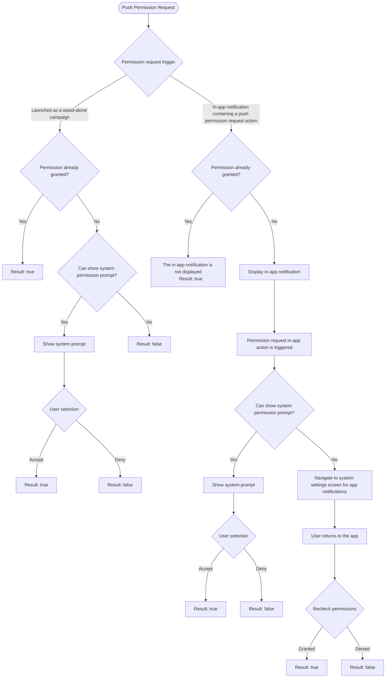

# System In-App Functions
CleverTap Android SDK 7.4.0+ supports a set of built-in in-app functions. They can be assigned to in-app notification button actions or used as stand-alone campaigns. To learn more about them, see the CleverTap documentation.

## Open URL
Launches an `Intent` with action `Intent.ACTION_VIEW` for the "Android" URL configured through the CleverTap Dashboard. All query params are added as extras to the `Intent`, which can be useful when the URL is a deeplink.

## Push Permission Request
This function starts the push permission request flow. Subscribe to the push permission result through `CleverTapAPI.registerPushPermissionNotificationResponseListener` to receive updates whenever the flow completes. Here is a summary of the flow and its results:



The push permission flow can also be manually triggered through `CleverTapAPI.promptPushPrimer` and `CleverTapAPI.promptForPushPermission`.

## In-App Google Play Store Review
Launches the Google Play In-App Review. Read more about how it works [here](https://developer.android.com/guide/playcore/in-app-review).

To use this system function, include the following dependency in your application build.gradle file:

```groovy
dependencies {
    // This dependency is downloaded from Google's Maven repository.
    // So, make sure you also include that repository in your project's build.gradle file.
    implementation 'com.google.android.play:review:2.0.2'
}
```

To test in-app reviews, follow the instructions in the Android documentation [here](https://developer.android.com/guide/playcore/in-app-review/test).
